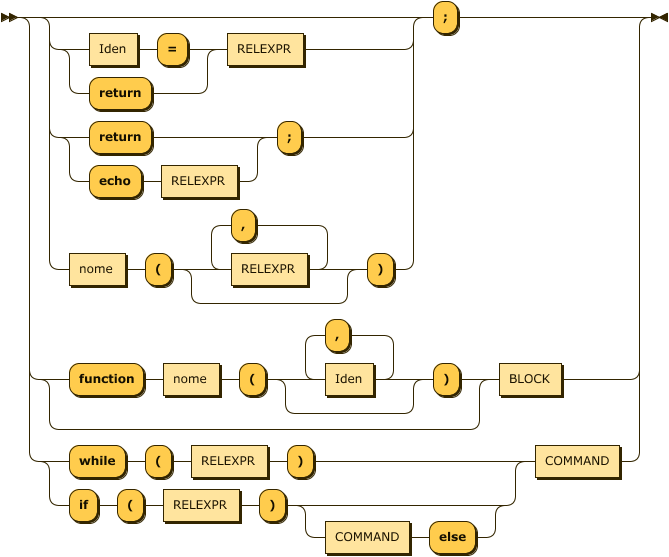
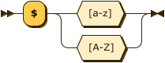
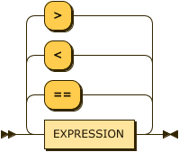
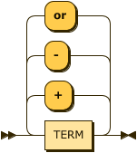
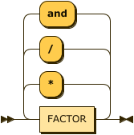
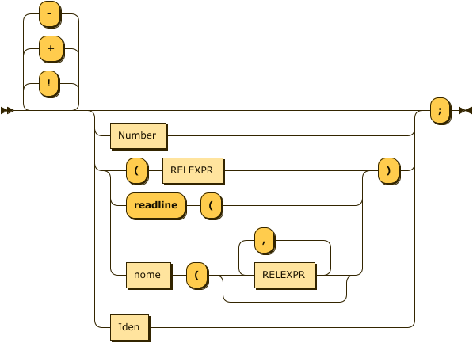
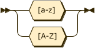

# Compilador - v2.4.3
Simple Calculator - PHP
---
## Run command example : 

```python
$ python main.py arquivo.php
```
Exemplo de arquivo.php
```python
<?php
function soma($x,$y){
    function echoes($b){
        echo $b;
    }
    $a=$x+$y;
    echoes($a);
}
$a=3;
soma($a,4);
?>
```
---
## Supported ops 
```python
tokens=["+","-","*","/","(",")","Number","if","while","else","==",">","<","!","true","false","string","functions"]
```
---
## Synthetic Diagram and EBNF 
PROGRAM:


`                                `

[PROGRAM](#PROGRAM "PROGRAM")  ::= '\<?php' [COMMAND](#COMMAND "COMMAND") '?\>'

no references

BLOCK:


`                                `

[BLOCK](#BLOCK "BLOCK")    ::= '{' [COMMAND](#COMMAND "COMMAND") '}'

referenced by:

-   [COMMAND](#COMMAND "COMMAND")

COMMAND:



`                                `

[COMMAND](#COMMAND "COMMAND")  ::= ( ( [Iden](#Iden "Iden") '=' | 'return' ) [RELEXPR](#RELEXPR "RELEXPR") | ( 'return' | 'echo' [RELEXPR](#RELEXPR "RELEXPR") ) ';' | [nome](#nome "nome") '(' ( [RELEXPR](#RELEXPR "RELEXPR") ( ',' [RELEXPR](#RELEXPR "RELEXPR") )\* )? ')' )? ';'

           | ( 'function' [nome](#nome "nome") '(' ( [Iden](#Iden "Iden") ( ',' [Iden](#Iden "Iden") )\* )? ')' )? [BLOCK](#BLOCK "BLOCK")

           | ( 'while' '(' [RELEXPR](#RELEXPR "RELEXPR") ')' | 'if' '(' [RELEXPR](#RELEXPR "RELEXPR") ')' ( [COMMAND](#COMMAND "COMMAND") 'else' )? ) [COMMAND](#COMMAND "COMMAND")

referenced by:

-   [BLOCK](#BLOCK "BLOCK")
-   [COMMAND](#COMMAND "COMMAND")
-   [PROGRAM](#PROGRAM "PROGRAM")

Iden:



`                                `

[Iden](#Iden "Iden")     ::= '\$' [a-zA-Z]

referenced by:

-   [COMMAND](#COMMAND "COMMAND")
-   [FACTOR](#FACTOR "FACTOR")

RELEXPR:



`                                `

[RELEXPR](#RELEXPR "RELEXPR")  ::= [EXPRESSION](#EXPRESSION "EXPRESSION") ( ( '==' | '\<' | '\>' ) [EXPRESSION](#EXPRESSION "EXPRESSION") )\*

referenced by:

-   [COMMAND](#COMMAND "COMMAND")
-   [FACTOR](#FACTOR "FACTOR")

EXPRESSION:



`                                `

[EXPRESSION](#EXPRESSION "EXPRESSION")

         ::= [TERM](#TERM "TERM") ( ( '+' | '-' | 'or' ) [TERM](#TERM "TERM") )\*

referenced by:

-   [ASSIGNMENT](#ASSIGNMENT "ASSIGNMENT")
-   [RELEXPR](#RELEXPR "RELEXPR")

TERM:



`                                `

[TERM](#TERM "TERM")     ::= [FACTOR](#FACTOR "FACTOR") ( ( '\*' | '/' | 'and' ) [FACTOR](#FACTOR "FACTOR") )\*

referenced by:

-   [EXPRESSION](#EXPRESSION "EXPRESSION")

FACTOR:



`                                `

[FACTOR](#FACTOR "FACTOR")   ::= ( '!' | '+' | '-' )\* ( [Number](#Number "Number") | ( '(' [RELEXPR](#RELEXPR "RELEXPR") | 'readline' '(' | [nome](#nome "nome") '(' ( [RELEXPR](#RELEXPR "RELEXPR") ( ',' [RELEXPR](#RELEXPR "RELEXPR") )\* )? ) ')' | [Iden](#Iden "Iden") )? ';'

referenced by:

-   [TERM](#TERM "TERM")

ASSIGNMENT:


`                                `

[ASSIGNMENT](#ASSIGNMENT "ASSIGNMENT")

         ::= [IDENTIFIER](#IDENTIFIER "IDENTIFIER") '=' [EXPRESSION](#EXPRESSION "EXPRESSION") ';'

no references

nome:



`                                `

[nome](#nome "nome")     ::= [a-zA-Z]

referenced by:

-   [COMMAND](#COMMAND "COMMAND")
-   [FACTOR](#FACTOR "FACTOR")

* * * * *

||
| |... generated by [RR - Railroad Diagram Generator](https://www.bottlecaps.de/rr/ui "https://www.bottlecaps.de/rr/ui")|[](https://www.bottlecaps.de/rr/ui "https://www.bottlecaps.de/rr/ui")|


